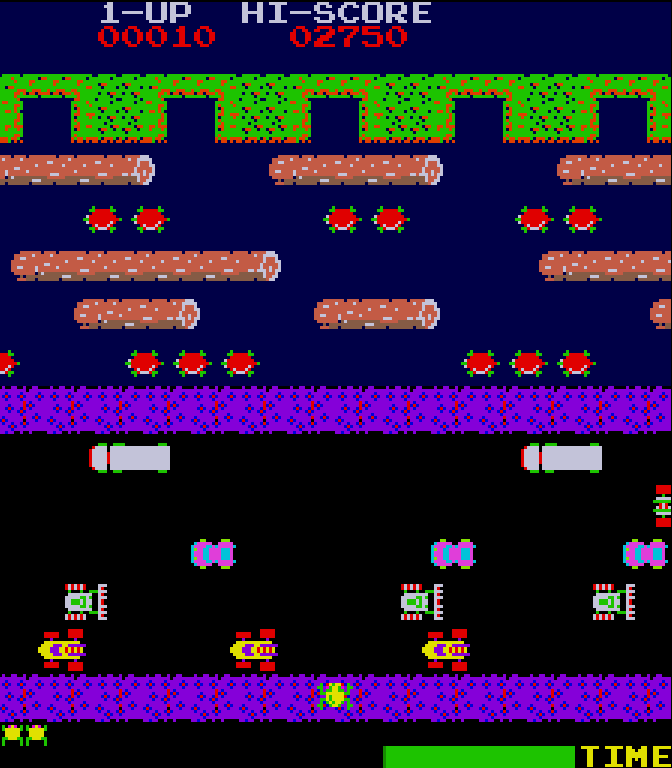

# Frogger - Visual Computing 2026-II

Recreación del juego [Frogger](https://en.wikipedia.org/wiki/Frogger) en el navegador, con JavaScript y la libreria p5.js. Proyecto forma parte del de curso Computación Visual (2026-II).



## Cómo jugar

| Tecla | Acción |
|---|---|
| Flechas / `W` `A` `S` `D` | Mover la rana (y el cursor del menú) |
| `Enter` | Elegir una opción |


## Ejecutar en local

No hay dependencias ni paso de compilación: p5.js ya está en `frogger/libraries/`. Solo hay que servir la carpeta del repositorio con cualquier servidor estático (abrir `./frogger/index.html` con `file://` no sirve, porque el navegador bloquea la carga de sprites y sonidos):

```bash
python3 -m http.server 8000
# abrir http://localhost:8000
```

## Jugar en linea

[Enlace de juego - click aquí](https://shryhakakizuki.github.io/Frogger-Visual_Computing_2026-II/)

## Estructura

```
frogger/    código del juego (index.html y los scripts)
images/     sprites
music/      música y efectos de sonido
docs/       documentación
```

Los scripts de `frogger/` estan organizados de la siguiente forma:

| Archivo | Qué contiene |
|---|---|
| `constants.js` | Medidas, tiempos, colores y puntos |
| `sprites.js`, `audio.js`, `storage.js` | Imágenes y texto, sonido y guardado del record |
| `entities.js` | Carros, troncos y tortugas |
| `frog.js` | La rana |
| `lanes.js` | Las filas del tablero y sus reglas |
| `menu.js` | Pantalla de título y créditos |
| `game.js` | La partida: estados, puntos, vidas y colisiones |
| `frogger.js` | Conexión con p5.js y teclado |

## Documentación

La documentación está en [`docs/`](docs/), organizada por temas:

| Documento | Contenido |
|---|---|
| [docs/TABLERO.md](docs/TABLERO.md) | Dimensiones del tablero y del HUD, tabla de filas, patrones de entidades y validación |
| [docs/ARQUITECTURA.md](docs/ARQUITECTURA.md) | Archivos y componentes, diagramas de clases y estados, flujo de un frame (Mermaid) |
| [docs/REGLAS.md](docs/REGLAS.md) | Reglas de juego, puntuación, timer y entrada por teclado |
| [docs/DISEÑO.md](docs/DISEÑO.md) | Decisiones de diseño y sus motivos |

## Estado

El primer nivel está **completo y jugable**: al llenar las 5 metas la partida termina con `WON` (no hay segundo nivel).

### Implementado

**Pantallas y presentación**

- Pantalla de título (`Menu`, según `FroggerTable.png`): logo `FROGGER`, opciones JUGAR / CREDITOS / DOCUMENTACION con una rana como cursor (flechas y Enter), submenú de créditos con VOLVER y enlace al repositorio en GitHub.
- Tablero de 13 filas con HUD arriba (`1-UP` y `HI-SCORE`) y abajo (vidas y barra de tiempo), con avisos `YOU WON` / `GAME OVER` sobre la mediana. Todos los textos usan la fuente del arcade (`font.png`, vía `drawText()`).
- Todo se dibuja con los sprites de `images/` a su tamaño real: canvas de 224×256, ampliado por CSS con un factor entero.

**Jugabilidad**

- Rana con saltos de una celda (flechas o WASD) y sprite de salto según la dirección. No puede salir del tablero por sus propios medios.
- Cinco filas de carretera (carros, bulldozers y camiones) y cinco de río (troncos y tortugas), cada una con su velocidad, dirección y patrón de entidades. Las entidades reaparecen con retraso (pista circular) y los patrones se validan al arrancar.
- Reglas: los carros matan, el río hunde, los troncos transportan, las tortugas que se hunden (una pareja en la fila 2 y un trío en la fila 5) ahogan a la rana si está encima cuando quedan bajo el agua, y morir arrastrada fuera del tablero también cuenta. Las metas pueden estar libres u ocupadas, y entre ellas hay paredes.
- La **mosca** aparece en una meta libre al azar y da 200 puntos de bonus si la rana llega ahí antes de que se vaya.
- Tiempo por vida de 30 s, contado en frames; al agotarse la rana muere. La barra del HUD pasa a rojo en los últimos 10 s.
- Animación de muerte según la causa (carretera, agua o tiempo), seguida de la calavera y una espera antes de reaparecer (estado `DYING`).
- Puntuación del original: 10 por cada fila nueva alcanzada, 50 por meta más 10 por cada segundo restante, 200 por la mosca y 1000 por llenar las 5. Vida extra a los 1000 puntos, una sola vez por partida.
- Récord (`HI-SCORE`) persistente en `localStorage` (`storage.js`).
- Estados `MENU` → `PLAYING` → `WON` / `GAME_OVER`; los dos últimos vuelven al menú a los 4 s (`END_SCREEN_FRAMES`, lo que dura `GameOver.mp3`) o con Enter.
- Música y sonidos (`audio.js`, archivos en `music/`): `HomeScreen` en bucle en el menú, `MainSoundtrack` en bucle durante la partida (no se corta al morir), `GameOver` una vez al ganar o perder; `Hop` en cada salto, `DieOnLand` (carretera, arbusto y tiempo), `Drown` (agua), `Homed` al llegar a una meta y `TimeWarning` una vez por vida al bajar de 10 s.

### Pendiente

- **Rana hembra**: bonus del original que aparece sobre un tronco. No está implementada; el sprite de la rana de la meta (`home_frog`) ya existe.

### Fuera del alcance

Cosas del juego original que no se hicieron porque el proyecto cubre solo el primer nivel:

- Serpiente, nutria y cocodrilos (en `images/` están sus sprites, pero ninguna fila los usa).
- Niveles siguientes, con tráfico más rápido.
- Pausa y opción de silenciar.

## Créditos

| Integrante | GitHub |
|---|---|
| Oscar Leonardo Riveros Perez | [ShryhakAkizuki](https://github.com/ShryhakAkizuki) |
| Camilo Londoño Moreno | [CamiloLM](https://github.com/CamiloLM) |
| Omar Nicolas Guerrero Guerrero | [camisabo](https://github.com/camisabo) |
| Oscar Ivan Ulises Gutierrez Palacios | [10scar](https://github.com/10scar) |