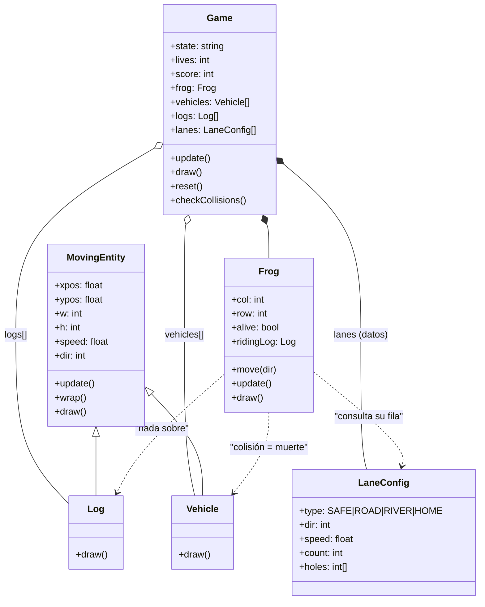
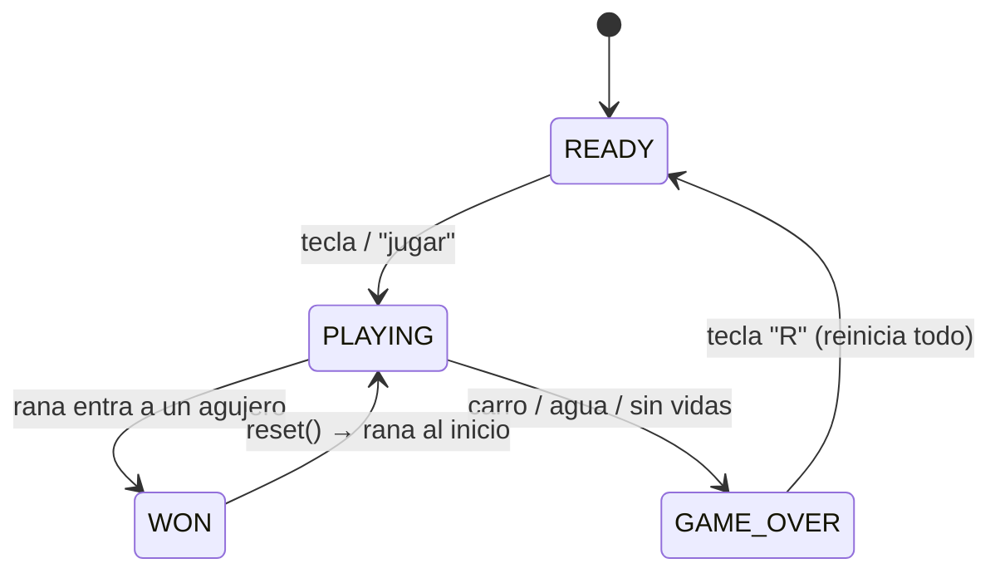
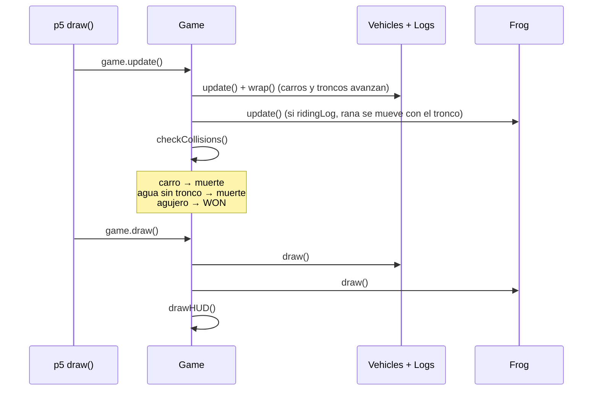

# Frogger — Arquitectura y flujo MVP

> Guía compacta para el equipo de desarrollo · Proyecto de curso: Visual Computing (2026-II).
> Stack: JavaScript (ES6+) + p5.js (local, sin CDN) · Despliegue: GitHub Pages.

## 1. Objetivo

Recrear la jugabilidad básica de Frogger: mover una rana sobre un tablero de 13×13 celdas, cruzar la carretera (evitar carros) y el río (nadar sobre troncos) hasta alcanzar uno de los 4 agujeros de la meta.

## 2. Alcance MVP

| ✅ Incluir | ❌ Excluir (post-MVP) |
|---|---|
| Rana con movimiento por grid (4 direcciones, 1 celda por tecla) | Tortugas que se detienen en orillas |
| Carretera con carros en movimiento | Sprites, sonidos, animaciones |
| Río con troncos en movimiento (transportan a la rana) | Temporizador por vida |
| Meta: 4 agujeros en la fila superior | Dificultad progresiva / múltiples niveles |
| Máquina de estados: `READY` / `PLAYING` / `WON` / `GAME_OVER` | Récord persistente |
| Vidas, score y HUD simple | Movimiento suave por píxeles |

## 3. Tablero (13 columnas × 13 filas · `CELL = 55px` → 715×715)

| Fila | Tipo | Contenido |
|---|---|---|
| 0 | `HOME` | 4 agujeros (columnas 1, 4, 7, 10) |
| 1 | `SAFE` | Orilla superior |
| 2–5 | `RIVER` | 4 filas de troncos, velocidades y direcciones distintas |
| 6 | `SAFE` | Isla central |
| 7–10 | `ROAD` | 4 filas de carros, velocidades y direcciones distintas |
| 11–12 | `SAFE` | Zona de inicio (rana en columna 6, fila 12) |

## 4. Componentes

| Componente | Responsabilidad | Archivo | Miembros clave |
|---|---|---|---|
| `Game` (orquestador) | Propietario del estado; coordina cada frame | `game.js` | `state`, `lives`, `score`, `frog`, `vehicles[]`, `logs[]`, `lanes[]`, `update()`, `draw()`, `reset()`, `checkCollisions()` |
| `Frog` (jugador) | Movimiento por grid | `game.js` | `col`, `row`, `alive`, `ridingLog`, `move(dir)`, `update()`, `draw()` |
| `MovingEntity` (base) | Desplazamiento horizontal con *wrap* (evoluciona del prototipo `Obstacle`) | `entities.js` | `xpos`, `ypos`, `w`, `h`, `speed`, `dir`, `update()`, `wrap()`, `draw()` |
| `Vehicle` | Carro (hereda de `MovingEntity`) | `entities.js` | `draw()` |
| `Log` | Tronco (hereda de `MovingEntity`) | `entities.js` | `draw()` |
| `lanes[]` (`LaneConfig`) | Define cada fila; cambiar el tablero no exige nuevo código | `game.js` | `type`, `dir`, `speed`, `count`, `holes[]` |
| Bootstrap p5 | `setup()`, `draw()`, `keyPressed()`, constantes de tablero | `frogger.js` | `CELL`, `COLS`, `ROWS`, `game` |

- Helper de colisiones: `rectsOverlap(a, b)` (AABB de 1 línea) en `game.js`.
- Convención: la **rana** vive en coordenadas de grid (`col`, `row`); las **entidades** en píxeles. La conversión ocurre solo al renderizar; las colisiones se resuelven en píxeles.

## 5. Diagramas

### 5.1 Componentes



### 5.2 Máquina de estados



### 5.3 Secuencia por frame (bucle de p5.js)



## 6. Reglas del juego (evaluadas cada frame en `Game.checkCollisions()`)

1. Rana sobre un `Vehicle` → muere.
2. Rana en fila `RIVER` sin tocar `Log` → muere (se hunde).
3. Rana tocando un `Log` → `ridingLog` la transporta (hereda la velocidad del tronco).
4. Rana en fila `HOME` sobre un agujero → estado `WON`.
5. `lives == 0` → estado `GAME_OVER`.

## 7. Entrada

`keyPressed()` global (flechas + WASD) → delega en `game.frog.move(dir)`. MVP: una celda por tecla, sin cooldown.

## 8. Estructura de archivos (plan B — adoptado)

El código se divide en 3 archivos JS + 2 HTML, sin bundler (compatible con GitHub Pages):

```
Frogger-Visual_Computing_2026-II/
├── index.html            # landing page: enlaces al juego y a la documentación
├── README.md
├── docs/
│   └── ARQUITECTURA.md
└── frogger/
    ├── index.html        # carga los scripts en orden: p5 → entities → game → frogger
    ├── frogger.js        # BOOTSTRAP p5: constantes (CELL, COLS, ROWS), setup(), draw(),
    │                     #   keyPressed() y la variable global `game`. SIN lógica.
    ├── game.js           # Game (orquestador), Frog, lanes[] (datos), GAME_STATES,
    │                     #   LANE_TYPES y rectsOverlap().
    ├── entities.js       # MovingEntity (base), Vehicle, Log.
    └── libraries/
        └── p5.min.js     # p5.js local (sin CDN)
```

**Orden de carga (obligatorio, ver [`frogger/index.html`](../frogger/index.html)):**
`libraries/p5.min.js` → `entities.js` → `game.js` → `frogger.js`.
La dependencia es lineal: `entities` no depende de nadie; `game` usa `entities`;
`frogger` (bootstrap) instancia `Game` de `game.js`.

**Regla de responsabilidad:** `frogger.js` solo interconecta p5.js con la lógica
(ninguna regla de juego); `game.js` contiene toda la lógica del juego; `entities.js`
solo define qué se mueve y cómo se pinta.

## 9. Estado actual del código (plantilla base)

| Existía antes de la refactorización | Estado hoy |
|---|---|
| Canvas p5 de 1280×720 | Redimensionado a 715×715 (`13 × CELL`) en [`setup()`](../frogger/frogger.js) |
| Clase `Obstacle` con `update()` **sin *wrap*** (se salía del canvas) | Evoluciona a [`MovingEntity`](../frogger/entities.js) con `wrap()` |
| Variable global `obstacle` suelta | Reemplazada por el orquestador `game` ([`frogger.js`](../frogger/frogger.js)) |
| p5.js local en [`index.html`](../frogger/index.html) | ✅ Sin cambios, compatible con GitHub Pages |

> **Nota:** la plantilla está lista (clases, herencia, orden de carga y bootstrap),
> pero los métodos de juego llevan `TODO`: faltan `lanes[]`, el render del tablero,
> la entrada y las colisiones (sección 10).

## 10. Orden sugerido de implementación

1. `lanes[]` (13 filas) en `game.js` + `drawBoard()` en `Game` (grass, road, river, agujeros).
2. Poblado en `setup()` (`frogger.js`): `game.frog = new Frog(6, 12)`, `vehicles[]` y `logs[]` desde `lanes`.
3. `Frog.move(dir)` + mapeo de teclas en `keyPressed()`.
4. `checkCollisions()` y reglas de la sección 6.
5. `reset()` + transiciones de estado (`WON`, `GAME_OVER`).
6. HUD (vidas, score) en `Game.draw()`.
