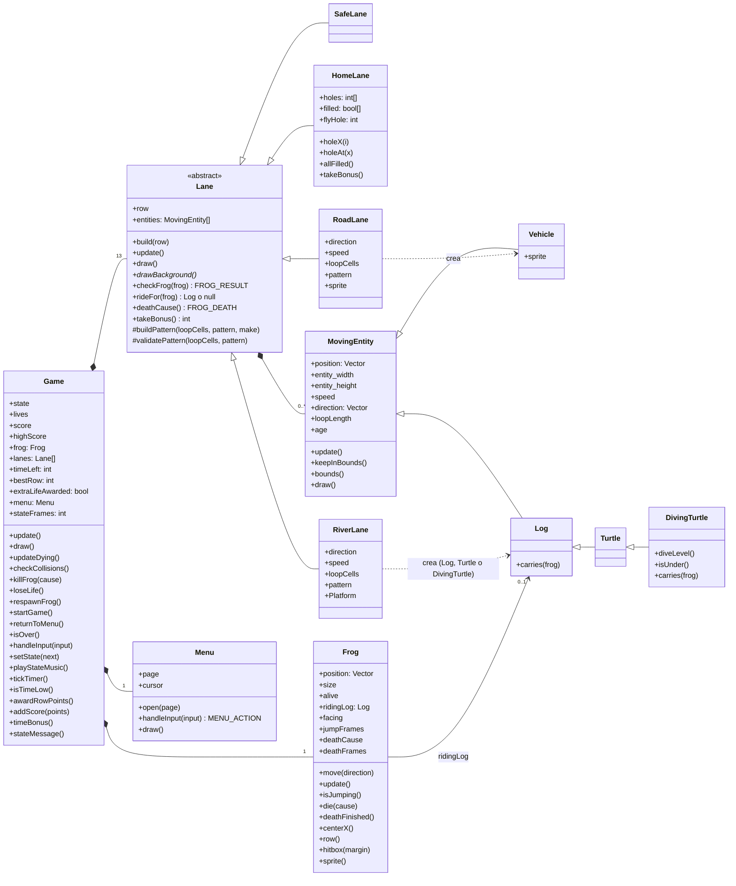
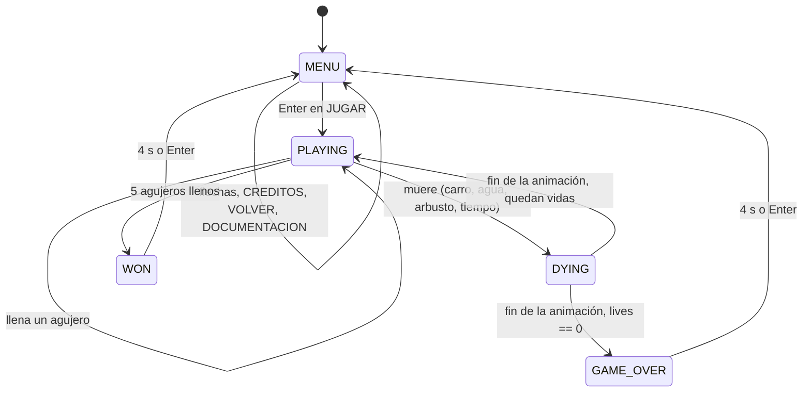
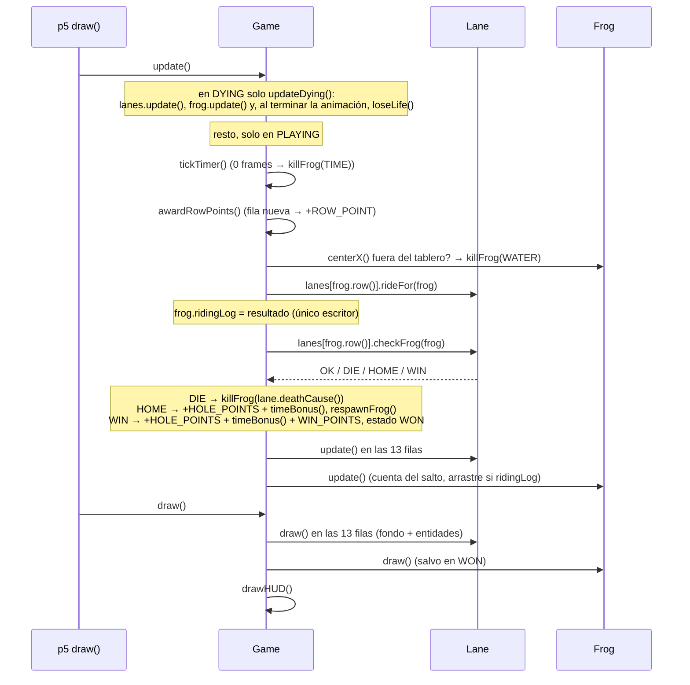

# Frogger - Arquitectura

## 1. Archivos y componentes

Sin bundler (compatible con GitHub Pages). Los scripts se cargan en este orden en [`frogger/index.html`](../frogger/index.html), y el orden es obligatorio:

`p5.min.js` → `constants.js` → `sprites.js` → `audio.js` → `storage.js` → `entities.js` → `frog.js` → `lanes.js` → `menu.js` → `game.js` → `frogger.js`

```
frogger/
├── index.html        # página del juego: carga los scripts en el orden anterior
├── constants.js      # constantes compartidas: dimensiones, FPS, animaciones, colores, reglas y puntuación
├── sprites.js        # SPRITES, loadSprites(), drawSprite(), drawText() (fuente del arcade)
├── audio.js          # SOUNDS, loadSounds(), playMusic(), stopMusic(), resumeMusic(), playSound()
├── storage.js        # loadHighScore(), saveHighScore(): récord en localStorage
├── entities.js       # MovingEntity (base), Vehicle, Log, Turtle, DivingTurtle
├── frog.js           # Frog, FROG_DEATH, rectsOverlap()
├── lanes.js          # Lane (interfaz base), SafeLane, HomeLane, RoadLane, RiverLane,
│                     #   FROG_RESULT
├── menu.js           # Menu (pantalla de título y créditos), MENU_PAGES, MENU_ACTION
├── game.js           # Game, LANES (definición de las 13 filas), GAME_STATES, INPUT
├── frogger.js        # bootstrap de p5: preload(), setup(), draw(), keyPressed(), escala del canvas. Sin lógica.
└── libraries/p5.min.js
```

Fuera de `frogger/`, en la raíz del repositorio:

- `images/` y `music/`: sprites y sonidos (el código los carga con `../images/...` y `../music/...`).
- `index.html`: redirige a `frogger/` para que la página de GitHub Pages abra el juego directamente.
- `.github/workflows/deploy-pages.yml`: publica el sitio estático en GitHub Pages con cada push a `main`.
- `FroggerAssets.png` y `FroggerTable.png`: referencias de arte (sprites y menú).

| Archivo | Responsabilidad |
|---|---|
| `constants.js` | Dimensiones (`CELL`, `COLS`, `ROWS`, `BOARD_W`, `BOARD_H`, `HUD_TOP`, `HUD_BOTTOM`, `FROG_X_OFFSET`), `FPS`, duración de animaciones, `COLORS` y reglas/puntuación de la partida. Sin lógica. |
| `sprites.js` | Carga las imágenes de `../images/` en `preload()` y las dibuja por nombre con la posición redondeada. `drawText()` escribe con `font.png` (glifos de 8×8 por color, sin tildes ni Ñ: se quitan al dibujar). |
| `audio.js` | Carga los mp3 de `../music/` en `preload()` como `<audio>` del navegador (sin p5.sound). Una sola pista de música a la vez (`playMusic()`; pedir la que ya suena no la reinicia) y efectos por nombre (`playSound()`). El navegador bloquea el audio hasta la primera tecla: `keyPressed()` llama a `resumeMusic()`. |
| `storage.js` | Lee y guarda el récord en `localStorage` (`frogger_highscore`). Si el navegador bloquea el almacenamiento, el juego sigue sin récord persistente. |
| `entities.js` | Qué se mueve y cómo se pinta. No conoce las reglas. |
| `frog.js` | El jugador: salto, arrastre por tronco, caja de colisión, animaciones de salto y muerte. |
| `lanes.js` | Las reglas **de cada tipo de fila**: qué le pasa a la rana en carretera, río o meta. |
| `menu.js` | La pantalla de título: páginas (principal y créditos), cursor y dibujo. No conoce la partida: al elegir JUGAR devuelve `MENU_ACTION.PLAY`. Los nombres de los créditos y el enlace a GitHub están aquí. |
| `game.js` | El estado de la partida (vidas, score, estado), la máquina de estados de entrada y las reglas **comunes**. |
| `frogger.js` | Conecta p5.js con `Game`: carga sprites, escala el canvas y traduce cada tecla a un `INPUT` neutro. |

Las constantes de `constants.js` se cargan primero (tras `p5.min.js`), así que todos los scripts pueden usarlas al cargar y las filas se crean directamente al cargar `game.js` (constante `LANES`). Las imágenes aún no existen en ese momento: filas y entidades guardan el **nombre** del sprite y lo buscan en `SPRITES` al dibujar.

## 2. Diagramas

### 2.1 Clases


```mermaid
classDiagram
    direction LR

    class Game {
        +state
        +lives
        +score
        +highScore
        +frog: Frog
        +lanes: Lane[]
        +timeLeft: int
        +bestRow: int
        +extraLifeAwarded: bool
        +menu: Menu
        +stateFrames: int
        +update()
        +draw()
        +updateDying()
        +checkCollisions()
        +killFrog(cause)
        +loseLife()
        +respawnFrog()
        +startGame()
        +returnToMenu()
        +isOver()
        +handleInput(input)
        +setState(next)
        +playStateMusic()
        +tickTimer()
        +isTimeLow()
        +awardRowPoints()
        +addScore(points)
        +timeBonus()
        +stateMessage()
    }

    class Lane {
        <<abstract>>
        +row
        +entities: MovingEntity[]
        +build(row)
        +update()
        +draw()
        +drawBackground()*
        +checkFrog(frog) FROG_RESULT
        +rideFor(frog) Log o null
        +deathCause() FROG_DEATH
        +takeBonus() int
        #buildPattern(loopCells, pattern, make)
        #validatePattern(loopCells, pattern)
    }
    class SafeLane
    class HomeLane {
        +holes: int[]
        +filled: bool[]
        +holeX(i)
        +holeAt(x)
        +allFilled()
        +flyHole: int
        +takeBonus()
    }
    class RoadLane {
        +direction
        +speed
        +loopCells
        +pattern
        +sprite
    }
    class RiverLane {
        +direction
        +speed
        +loopCells
        +pattern
        +Platform
    }

    class MovingEntity {
        +position: Vector
        +entity_width
        +entity_height
        +speed
        +direction: Vector
        +loopLength
        +age
        +update()
        +keepInBounds()
        +bounds()
        +draw()
    }
    class Vehicle {
        +sprite
    }
    class Log {
        +carries(frog)
    }
    class Turtle
    class DivingTurtle {
        +diveLevel()
        +isUnder()
        +carries(frog)
    }

    class Frog {
        +position: Vector
        +size
        +alive
        +ridingLog: Log
        +facing
        +jumpFrames
        +deathCause
        +deathFrames
        +move(direction)
        +update()
        +isJumping()
        +die(cause)
        +deathFinished()
        +centerX()
        +row()
        +hitbox(margin)
        +sprite()
    }

    class Menu {
        +page
        +cursor
        +open(page)
        +handleInput(input) MENU_ACTION
        +draw()
    }

    Game *-- "1" Menu
    Game *-- "13" Lane
    Game *-- "1" Frog
    Lane <|-- SafeLane
    Lane <|-- HomeLane
    Lane <|-- RoadLane
    Lane <|-- RiverLane
    Lane *-- "0..*" MovingEntity
    MovingEntity <|-- Vehicle
    MovingEntity <|-- Log
    Log <|-- Turtle
    Turtle <|-- DivingTurtle
    RoadLane ..> Vehicle : crea
    RiverLane ..> Log : crea (Log, Turtle o DivingTurtle)
    Frog --> "0..1" Log : ridingLog
```

- `Lane` es la interfaz que ve `Game`. Cada subclase **posee** sus entidades (`entities`), las crea en `build()` y decide qué le pasa a la rana en `checkFrog()`.
- `Game` no tiene listas de carros ni de troncos, y no pregunta de qué tipo es cada fila: recorre `lanes` y llama a los mismos métodos en todas.

### 2.2 Estados


```mermaid
stateDiagram-v2
    [*] --> MENU
    MENU --> MENU : flechas, CREDITOS, VOLVER, DOCUMENTACION
    MENU --> PLAYING : Enter en JUGAR
    PLAYING --> PLAYING : llena un agujero
    PLAYING --> DYING : muere (carro, agua, arbusto, tiempo)
    DYING --> PLAYING : fin de la animación, quedan vidas
    DYING --> GAME_OVER : fin de la animación, lives == 0
    PLAYING --> WON : 5 agujeros llenos
    WON --> MENU : 4 s o Enter
    GAME_OVER --> MENU : 4 s o Enter
```

### 2.3 Un frame


```mermaid
sequenceDiagram
    participant P5 as p5 draw()
    participant G as Game
    participant L as Lane
    participant F as Frog

    P5->>G: update()
    Note over G: en DYING solo updateDying():<br/>lanes.update(), frog.update() y, al terminar la animación, loseLife()
    Note over G: resto, solo en PLAYING
    G->>G: tickTimer() (0 frames → killFrog(TIME))
    G->>G: awardRowPoints() (fila nueva → +ROW_POINT)
    G->>F: centerX() fuera del tablero? → killFrog(WATER)
    G->>L: lanes[frog.row()].rideFor(frog)
    Note over G: frog.ridingLog = resultado (único escritor)
    G->>L: lanes[frog.row()].checkFrog(frog)
    L-->>G: OK / DIE / HOME / WIN
    Note over G: DIE → killFrog(lane.deathCause())<br/>HOME → +HOLE_POINTS + timeBonus(), respawnFrog()<br/>WIN → +HOLE_POINTS + timeBonus() + WIN_POINTS, estado WON
    G->>L: update() en las 13 filas
    G->>F: update() (cuenta del salto, arrastre si ridingLog)

    P5->>G: draw()
    G->>L: draw() en las 13 filas (fondo + entidades)
    G->>F: draw() (salvo en WON)
    G->>G: drawHUD()
```

Las reglas se aplican **antes** de mover. `Game.checkCollisions()` fija `frog.ridingLog` consultando `Lane.rideFor()` (único escritor: las filas no mutan a la rana), y después la rana y su tronco se desplazan lo mismo en ese frame, así que siguen alineados. El orden `tickTimer()` → `awardRowPoints()` → `checkCollisions()` → `lanes.update()` → `frog.update()` es exigido: el timer y las filas de puntos se resuelven sobre la posición de la rana del frame anterior, y `frog.update()` lee el `ridingLog` que acaba de fijar `checkCollisions()`.

---

Ver también: 
- [TABLERO.md](TABLERO.md) (definición y patrones de las filas)
- [REGLAS.md](REGLAS.md) (reglas que cada clase aplica)
- [DISEÑO.md](DISEÑO.md) (por qué se hizo así)
