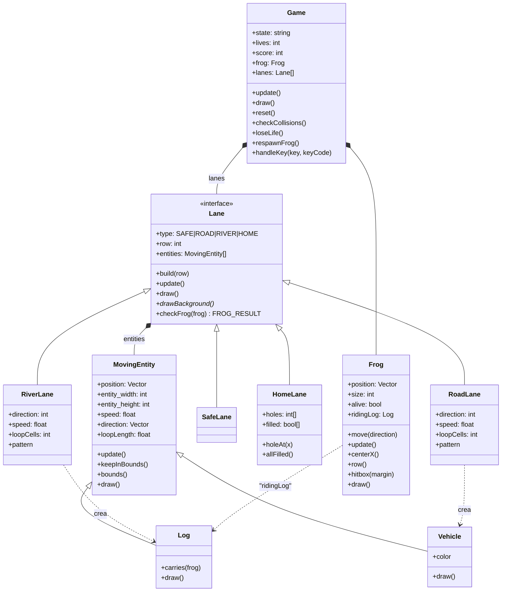
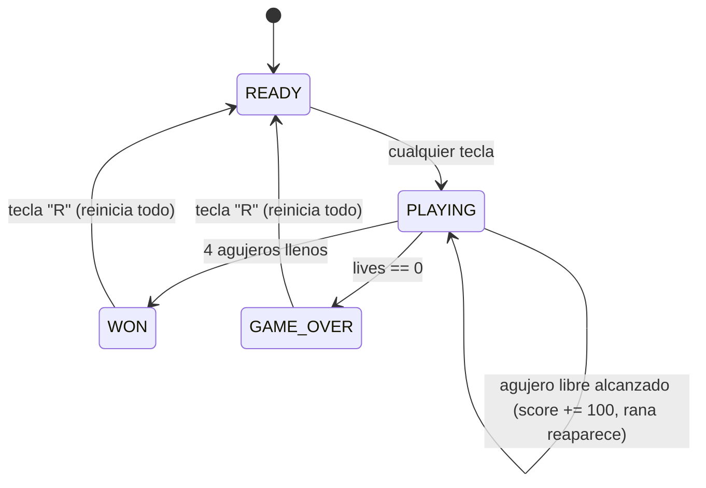
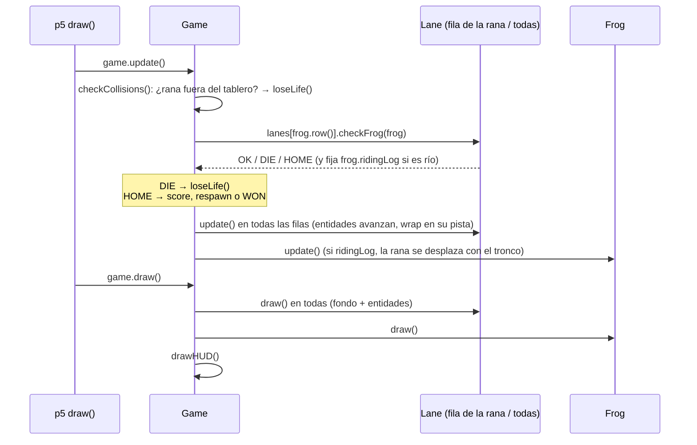

# Frogger — Arquitectura y flujo MVP

> Guía compacta para el equipo de desarrollo · Proyecto de curso: Visual Computing (2026-II).
> Stack: JavaScript (ES6+) + p5.js (local, sin CDN) · Despliegue: GitHub Pages.

## 1. Objetivo

Recrear la jugabilidad básica de Frogger: mover una rana sobre un tablero de 13×13 celdas, cruzar la carretera (evitar carros) y el río (nadar sobre troncos) hasta llenar los 4 agujeros de la meta.

## 2. Alcance MVP

| ✅ Incluir | ❌ Excluir (post-MVP) |
|---|---|
| Rana con movimiento de 1 celda (`CELL` px) por tecla, 4 direcciones | Tortugas que se detienen en orillas |
| Carretera con carros en movimiento | Sprites, sonidos, animaciones |
| Río con troncos en movimiento (transportan a la rana) | Temporizador por vida (límite que mata a la rana); el tiempo solo se muestra en el HUD |
| Meta: 4 agujeros en la fila superior | Dificultad progresiva / múltiples niveles |
| Máquina de estados: `READY` / `PLAYING` / `WON` / `GAME_OVER` | Récord persistente |
| Vidas, score y HUD simple | Movimiento suave de la rana (interpolado) |

## 3. Tablero (13 columnas × 13 filas · `CELL = 55px` → tablero 715×715, canvas 715×825)

El canvas añade dos barras de HUD de `HUD_H = CELL` de alto: una **arriba** del tablero (score) y otra **abajo** (vidas y tiempo). Al dibujar, `Game.draw()` desplaza el tablero con `translate(0, HUD_H)`, de modo que la lógica sigue usando coordenadas del tablero (`y = 0` es la fila `HOME`); el HUD se dibuja sin desplazamiento.

| Fila | Tipo | Contenido |
|---|---|---|
| 0 | `HOME` | 4 agujeros (columnas 1, 4, 7, 10) |
| 1–5 | `RIVER` | 5 filas de troncos, velocidades y direcciones distintas |
| 6 | `SAFE` | Isla central |
| 7–11 | `ROAD` | 5 filas de carros, velocidades y direcciones distintas |
| 12 | `SAFE` | Zona de inicio (rana en columna 6, fila 12) |

### 3.1 Filas en movimiento: velocidad y patrón (valores iniciales, ajustables)

La velocidad y la dirección son de la **fila**: todos sus carros o troncos las comparten. El **ancho** es de cada entidad (troncos cortos y largos, carros y camiones). Cada fila se define a mano en `createLanes()` (`game.js`) con `(direction, speed, loopCells, pattern)`:

- `speed`: píxeles por frame; `direction`: −1 (←) o +1 (→).
- `loopCells`: longitud de la **pista circular** de la fila, en celdas. Las celdas 0–12 son visibles; las de 13 en adelante quedan fuera de pantalla. Una entidad que sale por un lado recorre ese tramo oculto antes de volver a entrar por el otro, lo que produce el retraso de reaparición del juego original. El retraso dura `(loopCells − 13 − w) × CELL / speed` frames, aproximadamente.
- `pattern`: lista `[{ x, w }]` con la posición inicial y el ancho de cada entidad, en celdas sobre la pista (`x` ≥ 13 = empieza fuera de pantalla).

Restricciones (las comprueba `Lane.validatePattern()` al crear la fila, y lanza un error que dice qué fila está mal):

- `loopCells ≥ 13 + w` de la entidad más ancha; si no, al dar la vuelta aparecería de golpe dentro del tablero.
- Las entidades no se solapan, tampoco a través del *wrap*.

| Fila | Tipo | `direction` | `speed` | `loopCells` | `pattern` (`x`/`w`) |
|---|---|---|---|---|---|
| 1 | `RIVER` | ← | 1.25 | 18 | 0/3 · 6/4 · 12/3 |
| 2 | `RIVER` | → | 1.0 | 17 | 0/4 · 7/4 · 13/2 |
| 3 | `RIVER` | ← | 1.5 | 18 | 1/5 · 9/3 · 14/2 |
| 4 | `RIVER` | → | 2.0 | 17 | 0/2 · 5/3 · 11/2 |
| 5 | `RIVER` | ← | 1.25 | 18 | 2/4 · 9/4 |
| 7 | `ROAD` | ← | 1.5 | 15 | 0/1 · 4/1 · 8/1 |
| 8 | `ROAD` | → | 2.5 | 16 | 0/2 · 7/2 |
| 9 | `ROAD` | ← | 2.0 | 17 | 0/3 · 8/3 (camiones) |
| 10 | `ROAD` | → | 3.0 | 16 | 3/1 (un carro rápido) |
| 11 | `ROAD` | ← | 1.75 | 16 | 0/1 · 3/1 · 9/2 |

Consecuencia para la rana: sobre un tronco se mueve a la velocidad de **ese** tronco (es decir, de su fila), así que cambia al saltar a otra fila del río (regla 3).

## 4. Componentes

| Componente | Responsabilidad | Archivo | Miembros clave |
|---|---|---|---|
| `Game` (orquestador) | Propietario del estado (vidas, score, estado); coordina cada frame y reacciona a lo que dicen las filas | `game.js` | `state`, `lives`, `score`, `frog`, `lanes[]`, `update()`, `draw()`, `drawBoard()`, `drawHUD()`, `checkCollisions()`, `loseLife()`, `respawnFrog()`, `reset()`, `handleKey()` |
| `Frog` (jugador) | Saltos de una celda; arrastre por tronco; su caja de colisión | `frog.js` | `position`, `size`, `alive`, `ridingLog`, `move(direction)`, `update()`, `centerX()`, `row()`, `hitbox(margin)`, `draw()` |
| `MovingEntity` (base) | Desplazamiento horizontal sobre una pista circular | `entities.js` | `position`, `entity_width`, `entity_height`, `speed`, `direction`, `loopLength`, `update()`, `keepInBounds()`, `bounds()`, `draw()` |
| `Vehicle` | Carro (hereda de `MovingEntity`) | `entities.js` | `color`, `draw()` |
| `Log` | Tronco (hereda de `MovingEntity`) | `entities.js` | `carries(frog)`, `draw()` |
| `Lane` (interfaz base) | Contrato de toda fila: posee sus entidades, las crea, mueve y dibuja, y decide qué le pasa a la rana en ella | `lanes.js` | `type`, `row`, `entities[]`, `build(row)`, `update()`, `draw()`, `drawBackground()` (obligatorio), `checkFrog(frog)`, `buildPattern()`, `validatePattern()` |
| `SafeLane` / `HomeLane` / `RoadLane` / `RiverLane` | Una clase por tipo de fila, heredan de `Lane` | `lanes.js` | Home: `holes[]`, `filled[]`, `holeAt(x)`, `allFilled()` · Road / River: `direction`, `speed`, `loopCells`, `pattern` |
| Bootstrap p5 | `setup()`, `draw()`, `keyPressed()`, constantes de tablero | `frogger.js` | `CELL`, `COLS`, `ROWS`, `BOARD`, `HUD_H`, `game` |

- `Lane.checkFrog(frog)` devuelve un `FROG_RESULT`: `OK`, `DIE` o `HOME`. `Game` solo reacciona (resta vida, suma puntos, cambia de estado); no sabe qué tipo de fila es cada una.
- Helper de colisiones: `rectsOverlap(a, b)` (AABB) en `frog.js`, sobre cajas `{ x, y, w, h }` (`frog.hitbox()`, `entity.bounds()`).
- **Convención de coordenadas:** todo (rana y entidades) vive en **píxeles del tablero** como `p5.Vector` (`position`, esquina superior izquierda). La rana salta exactamente `CELL` píxeles por tecla, de modo que al estar en tierra queda alineada a la celda; sobre un tronco su `position.x` puede quedar fuera de la rejilla. Su fila se obtiene con `frog.row()`.
- Velocidades en **píxeles por frame**, dirección como vector unitario (`createVector(±1, 0)`).

## 5. Diagramas

### 5.1 Componentes


```mermaid
classDiagram
    class Game {
        +state: string
        +lives: int
        +score: int
        +frog: Frog
        +lanes: Lane[]
        +update()
        +draw()
        +reset()
        +checkCollisions()
        +loseLife()
        +respawnFrog()
        +handleKey(key, keyCode)
    }
    class Frog {
        +position: Vector
        +size: int
        +alive: bool
        +ridingLog: Log
        +move(direction)
        +update()
        +centerX()
        +row()
        +hitbox(margin)
        +draw()
    }
    class MovingEntity {
        +position: Vector
        +entity_width: int
        +entity_height: int
        +speed: float
        +direction: Vector
        +loopLength: float
        +update()
        +keepInBounds()
        +bounds()
        +draw()
    }
    class Vehicle {
        +color
        +draw()
    }
    class Log {
        +carries(frog)
        +draw()
    }
    class Lane {
        <<interface>>
        +type: SAFE|ROAD|RIVER|HOME
        +row: int
        +entities: MovingEntity[]
        +build(row)
        +update()
        +draw()
        +drawBackground()*
        +checkFrog(frog) FROG_RESULT
    }
    class SafeLane
    class HomeLane {
        +holes: int[]
        +filled: bool[]
        +holeAt(x)
        +allFilled()
    }
    class RoadLane {
        +direction: int
        +speed: float
        +loopCells: int
        +pattern
    }
    class RiverLane {
        +direction: int
        +speed: float
        +loopCells: int
        +pattern
    }
    Game *-- Frog
    Game *-- Lane : lanes
    Lane <|-- SafeLane
    Lane <|-- HomeLane
    Lane <|-- RoadLane
    Lane <|-- RiverLane
    Lane *-- MovingEntity : entities
    MovingEntity <|-- Vehicle
    MovingEntity <|-- Log
    RoadLane ..> Vehicle : crea
    RiverLane ..> Log : crea
    Frog ..> Log : "ridingLog"
```

### 5.2 Máquina de estados


```mermaid
stateDiagram-v2
    [*] --> READY
    READY --> PLAYING : cualquier tecla
    PLAYING --> PLAYING : muerte con vidas restantes (lives--, rana reaparece)
    PLAYING --> PLAYING : agujero libre alcanzado (score += 100, rana reaparece)
    PLAYING --> WON : 4 agujeros llenos
    PLAYING --> GAME_OVER : lives == 0
    WON --> READY : tecla "R" (reinicia todo)
    GAME_OVER --> READY : tecla "R" (reinicia todo)
```

### 5.3 Secuencia por frame (bucle de p5.js)


```mermaid
sequenceDiagram
    participant P5 as p5 draw()
    participant G as Game
    participant L as Lane (fila de la rana / todas)
    participant F as Frog
    P5->>G: game.update()
    G->>G: checkCollisions(): ¿rana fuera del tablero? → loseLife()
    G->>L: lanes[frog.row()].checkFrog(frog)
    L-->>G: OK / DIE / HOME (y fija frog.ridingLog si es río)
    Note over G: DIE → loseLife()<br/>HOME → score, respawn o WON
    G->>L: update() en todas las filas (entidades avanzan, wrap en su pista)
    G->>F: update() (si ridingLog, la rana se desplaza con el tronco)
    P5->>G: game.draw()
    G->>L: draw() en todas (fondo + entidades)
    G->>F: draw()
    G->>G: drawHUD()
```

## 6. Reglas del juego (evaluadas cada frame)

`Game.checkCollisions()` aplica las reglas comunes y le pregunta a la fila en la que está la rana (`Lane.checkFrog()`) por las demás:

1. **Carretera** (`RoadLane`): la caja de la rana (`frog.hitbox()`, reducida 4 px por lado) se solapa con un `Vehicle` → muere.
2. **Río** (`RiverLane`): el centro de la rana no está sobre ningún `Log` → muere (se hunde).
3. **Río** (`RiverLane`): el centro de la rana está sobre un `Log` → `ridingLog` la transporta (hereda la velocidad y dirección de su fila).
4. **Meta** (`HomeLane`): el centro de la rana cae en un agujero libre → se marca como lleno, +100 puntos y la rana reaparece.
5. **Meta** (`HomeLane`): el centro cae fuera de un agujero, o en uno ya lleno → muere.
6. **Común** (`Game`): el centro de la rana sale del tablero (arrastrada por un tronco) → muere. Toda muerte resta una vida y la rana reaparece en el inicio; con `lives == 0` → `GAME_OVER`.
7. **Común** (`Game`): los 4 agujeros llenos → `WON`.

## 7. Entrada

`keyPressed()` global → `game.handleKey(key, keyCode)`, que según el estado inicia la partida, reinicia o traduce flechas + WASD a un vector de `CELL` píxeles para `game.frog.move(direction)`. MVP: una celda por tecla, sin cooldown. En `READY` cualquier tecla inicia la partida; en `WON` / `GAME_OVER`, la tecla `R` reinicia.

## 8. Estructura de archivos

El código se divide en 5 archivos JS + 2 HTML, sin bundler (compatible con GitHub Pages):

```
Frogger-Visual_Computing_2026-II/
├── index.html            # landing page: enlaces al juego y a la documentación
├── README.md
├── docs/
│   └── ARQUITECTURA.md
└── frogger/
    ├── index.html        # carga los scripts en orden: p5 → entities → frog → lanes → game → frogger
    ├── frogger.js        # BOOTSTRAP p5: constantes (CELL, COLS, ROWS, BOARD, HUD_H), setup(),
    │                     #   draw(), keyPressed() y la variable global `game`. SIN lógica.
    ├── entities.js       # MovingEntity (base, pista circular), Vehicle, Log.
    ├── frog.js           # Frog (jugador) y rectsOverlap().
    ├── lanes.js          # Lane (interfaz base), SafeLane, HomeLane, RoadLane, RiverLane,
    │                     #   LANE_TYPES, FROG_RESULT.
    ├── game.js           # Game (orquestador), createLanes() (definición de las 13 filas),
    │                     #   GAME_STATES, HOME_POINTS.
    └── libraries/
        └── p5.min.js     # p5.js local (sin CDN)
```

**Orden de carga (obligatorio, ver [`frogger/index.html`](../frogger/index.html)):**
`libraries/p5.min.js` → `entities.js` → `frog.js` → `lanes.js` → `game.js` → `frogger.js`.
La dependencia es lineal: `entities` y `frog` no dependen de nadie; `lanes` usa `entities` y `frog`; `game` usa `frog` y `lanes`;
`frogger` (bootstrap) instancia `Game` de `game.js`. Las constantes de `frogger.js` (`CELL`, `BOARD`…) solo se usan en tiempo de ejecución, por eso las filas se crean dentro de `createLanes()` y no al cargar `game.js`.

**Regla de responsabilidad:** `frogger.js` solo interconecta p5.js con la lógica
(ninguna regla de juego); `game.js` contiene el estado de la partida y las reglas comunes; `lanes.js` las reglas
de cada tipo de fila; `frog.js` el jugador; `entities.js` solo define qué se mueve y cómo se pinta.

## 9. Decisiones de diseño y casos borde

| Tema | Decisión |
|---|---|
| Quién posee las entidades | Cada fila (`Lane.entities`). `Game` no tiene listas de carros ni troncos ni usa `instanceof`: recorre las filas y llama a los mismos métodos (polimorfismo). |
| Reaparición de entidades | Pista circular por fila (`loopCells`), con un tramo fuera de pantalla. Las entidades se crean una vez por partida y nunca se borran; el retraso de reentrada sale solo de la longitud de la pista. Se descartó un *spawner* (crear/borrar en el borde) por ser más complejo para el mismo resultado. |
| Patrón de cada fila | Definido a mano (`pattern` en celdas), no generado: es determinista y fácil de afinar jugando. Validado al crear la fila. |
| Entidades de distinto ancho | El ancho es por entidad; velocidad y dirección por fila. `loopCells` debe dejar sitio a la más ancha. |
| Colisión con carros | AABB con la caja de la rana reducida 4 px por lado (`frog.hitbox()`): rozar un carro con el borde no mata. |
| Colisión con troncos | Por el **centro** de la rana (`Log.carries()`), no por solape: tocar un tronco solo con la esquina no basta para subirse. |
| Agujeros | Por el centro de la rana (`HomeLane.holeAt()`), porque puede llegar desalineada desde un tronco. |
| Rana arrastrada fuera del tablero | Muere cuando su centro sale del tablero. El arrastre **no** usa `move()` (que bloquea en los bordes), sino un desplazamiento directo de `position`. |
| Orden dentro del frame | Primero reglas (fijan `ridingLog`), luego movimiento. La rana y su tronco se desplazan lo mismo en el frame, así que siguen alineados. |
| Timestep | Velocidades en píxeles por frame (60 FPS fijos de p5). Sin `deltaTime` en el MVP; el juego depende del framerate y se asume. |
| `Frog` en `frog.js` | Archivo propio: contiene lógica del jugador (arrastre, estado `alive`) y no es una entidad que se mueve sola, por eso no va en `entities.js`. |
| Reaparición de la rana | Columna 6, fila 12, `ridingLog = null`, `alive = true`. |

## 10. Avance de implementación

**Hecho:**

- [x] `MovingEntity`, `Vehicle`, `Log` con pista circular (`loopLength`).
- [x] `Frog` con movimiento por teclas (flechas + WASD), arrastre directo por tronco y caja de colisión reducida.
- [x] `Game` como orquestador, con estados `READY` / `PLAYING` / `WON` / `GAME_OVER`, vidas, score y reaparición.
- [x] Filas polimórficas en `lanes.js` que poseen sus entidades; 13 filas definidas a mano con patrón validado.
- [x] Reglas 1–7 (carros, río, troncos, agujeros, salida del tablero, vidas, victoria).
- [x] Tablero de 715×715, canvas de 715×825 con las dos barras de HUD (score, vidas).

**Pendiente:**

1. HUD: tiempo y mensajes de estado (`READY`, `WON`, `GAME_OVER`) en `drawHUD()`.
2. Afinar velocidades y patrones jugando.
3. Colores por fila o por tipo de vehículo (hoy todos los carros son rojos).
