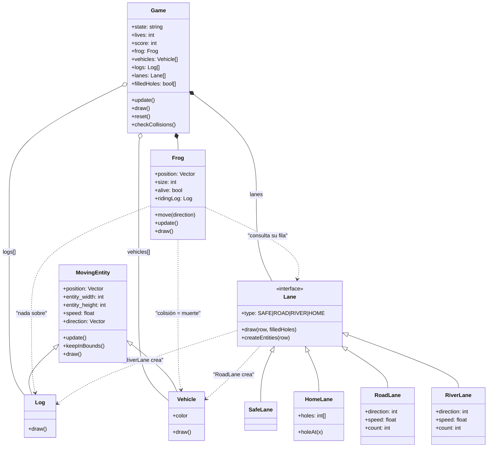
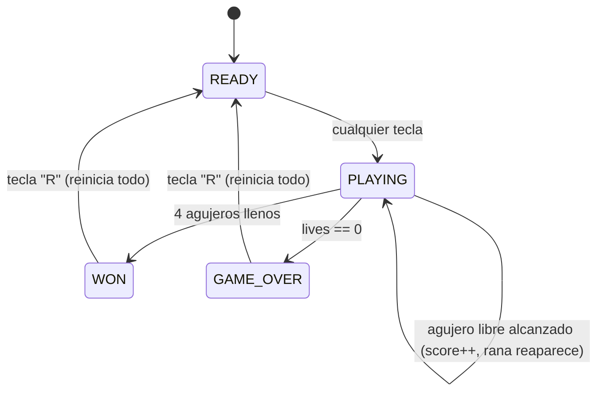
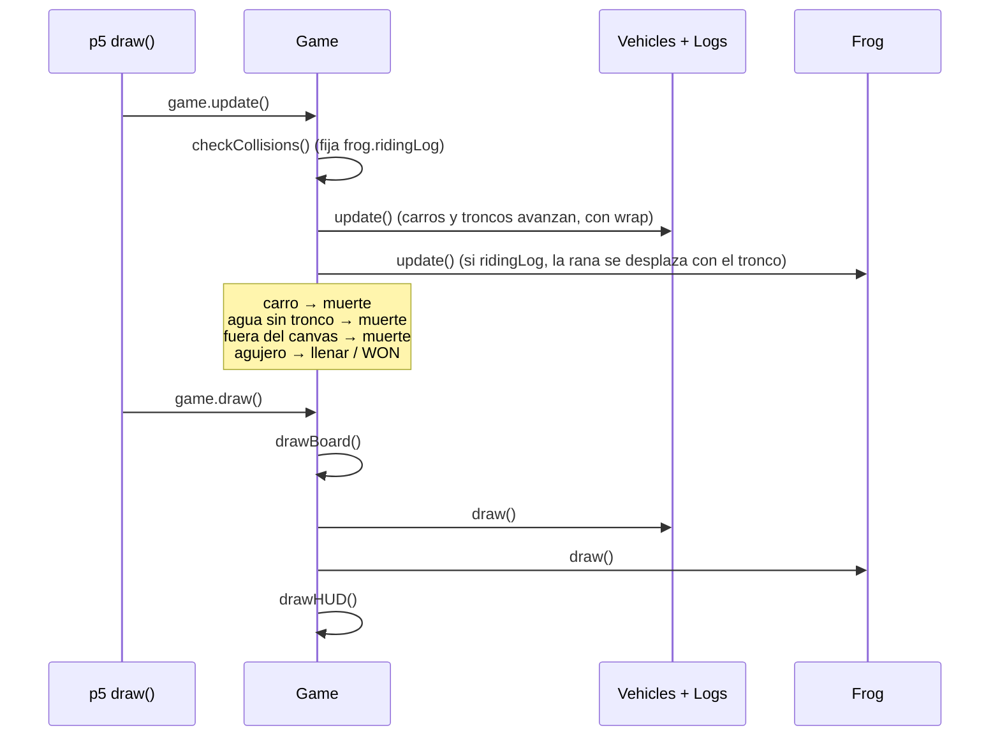

# Frogger — Arquitectura y flujo MVP

> Guía compacta para el equipo de desarrollo · Proyecto de curso: Visual Computing (2026-II).
> Stack: JavaScript (ES6+) + p5.js (local, sin CDN) · Despliegue: GitHub Pages.

## 1. Objetivo

Recrear la jugabilidad básica de Frogger: mover una rana sobre un tablero de 13×13 celdas, cruzar la carretera (evitar carros) y el río (nadar sobre troncos) hasta llenar los 4 agujeros de la meta.

## 2. Alcance MVP

| ✅ Incluir | ❌ Excluir (post-MVP) |
|---|---|
| Rana con movimiento de 1 celda (`CELL` px) por tecla, 4 direcciones | Tortugas que se detienen en orillas |
| Carretera con carros en movimiento | Sprites, sonidos, animaciones |
| Río con troncos en movimiento (transportan a la rana) | Temporizador por vida (límite que mata a la rana); el tiempo solo se muestra en el HUD |
| Meta: 4 agujeros en la fila superior | Dificultad progresiva / múltiples niveles |
| Máquina de estados: `READY` / `PLAYING` / `WON` / `GAME_OVER` | Récord persistente |
| Vidas, score y HUD simple | Movimiento suave de la rana (interpolado) |

## 3. Tablero (13 columnas × 13 filas · `CELL = 55px` → tablero 715×715, canvas 715×825)

El canvas añade dos barras de HUD de `HUD_H = CELL` de alto: una **arriba** del tablero (score) y otra **abajo** (vidas y tiempo). Al dibujar, `Game.draw()` desplaza el tablero con `translate(0, HUD_H)`, de modo que la lógica sigue usando coordenadas del tablero (`y = 0` es la fila `HOME`); el HUD se dibuja sin desplazamiento.

| Fila | Tipo | Contenido |
|---|---|---|
| 0 | `HOME` | 4 agujeros (columnas 1, 4, 7, 10) |
| 1–5 | `RIVER` | 5 filas de troncos, velocidades y direcciones distintas |
| 6 | `SAFE` | Isla central |
| 7–11 | `ROAD` | 5 filas de carros, velocidades y direcciones distintas |
| 12 | `SAFE` | Zona de inicio (rana en columna 6, fila 12) |

### 3.1 Velocidades por fila (valores iniciales, ajustables)

La velocidad es una propiedad de la **fila** (atributo `speed` de cada objeto `Lane`), no de la entidad: todos los carros o troncos de una misma fila comparten velocidad y dirección, y cada fila tiene una distinta. Unidades: píxeles por frame; el signo lo da `direction`.

| Fila | Tipo | `direction` | `speed` | Nota |
|---|---|---|---|---|
| 1 | `RIVER` | ← (−1) | 1.25 | |
| 2 | `RIVER` | → (+1) | 1.0 | troncos lentos |
| 3 | `RIVER` | ← (−1) | 1.5 | |
| 4 | `RIVER` | → (+1) | 2.0 | |
| 5 | `RIVER` | ← (−1) | 1.25 | |
| 7 | `ROAD` | ← (−1) | 1.5 | |
| 8 | `ROAD` | → (+1) | 2.5 | |
| 9 | `ROAD` | ← (−1) | 2.0 | |
| 10 | `ROAD` | → (+1) | 3.0 | carros más rápidos |
| 11 | `ROAD` | ← (−1) | 1.75 | |

Consecuencia para la rana: sobre un tronco se mueve a la velocidad de **ese** tronco (es decir, de su fila), así que cambia al saltar a otra fila del río (regla 3).

## 4. Componentes

| Componente | Responsabilidad | Archivo | Miembros clave |
|---|---|---|---|
| `Game` (orquestador) | Propietario del estado; coordina cada frame | `game.js` | `state`, `lives`, `score`, `frog`, `vehicles[]`, `logs[]`, `lanes[]` (objetos `Lane`), `filledHoles[]`, `update()`, `draw()`, `drawBoard()`, `drawHUD()`, `buildEntities()`, `checkCollisions()`, `loseLife()`, `respawnFrog()`, `reset()`, `handleKey()` |
| `Frog` (jugador) | Movimiento por saltos de una celda; arrastre por tronco | `game.js` | `position`, `size`, `alive`, `ridingLog`, `move(direction)`, `update()`, `draw()` |
| `MovingEntity` (base) | Desplazamiento horizontal con *wrap* | `entities.js` | `position`, `entity_width`, `entity_height`, `speed`, `direction`, `update()`, `keepInBounds()`, `draw()` |
| `Vehicle` | Carro (hereda de `MovingEntity`) | `entities.js` | `color`, `draw()` |
| `Log` | Tronco (hereda de `MovingEntity`) | `entities.js` | `draw()` |
| `Lane` (interfaz base) | Contrato de toda fila: `draw(row, filledHoles)` (obligatorio) y `createEntities(row)` (por defecto `[]`) | `lanes.js` | `type`, `draw()`, `createEntities()`, `fillRow()`, `spawnEvenly()` |
| `SafeLane` / `HomeLane` / `RoadLane` / `RiverLane` | Una clase por tipo de fila, heredan de `Lane`. Cada objeto lleva su propia velocidad, dirección y cantidad (§3.1) | `lanes.js` | `holes[]` + `holeAt(x)` (Home) · `direction`, `speed`, `count` (Road / River) |
| Bootstrap p5 | `setup()`, `draw()`, `keyPressed()`, constantes de tablero | `frogger.js` | `CELL`, `COLS`, `ROWS`, `BOARD`, `HUD_H`, `game` |

- Helper de colisiones: `rectsOverlap(a, b)` (AABB) en `frog.js`.
- **Convención de coordenadas:** todo (rana y entidades) vive en **píxeles** como `p5.Vector` (`position`, esquina superior izquierda). La rana salta exactamente `CELL` píxeles por tecla, de modo que al estar en tierra queda alineada a la celda; sobre un tronco su `position.x` puede quedar fuera de la rejilla. La fila se obtiene con `floor(position.y / CELL)` y se usa para consultar `lanes[]`.
- Velocidades en **píxeles por frame**, dirección como vector unitario (`createVector(±1, 0)`).

## 5. Diagramas

### 5.1 Componentes


```mermaid
classDiagram
    class Game {
        +state: string
        +lives: int
        +score: int
        +frog: Frog
        +vehicles: Vehicle[]
        +logs: Log[]
        +lanes: Lane[]
        +filledHoles: bool[]
        +update()
        +draw()
        +reset()
        +checkCollisions()
    }
    class Frog {
        +position: Vector
        +size: int
        +alive: bool
        +ridingLog: Log
        +move(direction)
        +update()
        +draw()
    }
    class MovingEntity {
        +position: Vector
        +entity_width: int
        +entity_height: int
        +speed: float
        +direction: Vector
        +update()
        +keepInBounds()
        +draw()
    }
    class Vehicle {
        +color
        +draw()
    }
    class Log {
        +draw()
    }
    class Lane {
        <<interface>>
        +type: SAFE|ROAD|RIVER|HOME
        +draw(row, filledHoles)
        +createEntities(row)
    }
    class SafeLane
    class HomeLane {
        +holes: int[]
        +holeAt(x)
    }
    class RoadLane {
        +direction: int
        +speed: float
        +count: int
    }
    class RiverLane {
        +direction: int
        +speed: float
        +count: int
    }
    Game *-- Frog
    Game *-- Lane : lanes
    Game o-- Vehicle : vehicles[]
    Game o-- Log : logs[]
    MovingEntity <|-- Vehicle
    MovingEntity <|-- Log
    Frog ..> Log : "nada sobre"
    Frog ..> Vehicle : "colisión = muerte"
    Lane <|-- SafeLane
    Lane <|-- HomeLane
    Lane <|-- RoadLane
    Lane <|-- RiverLane
    Lane ..> Vehicle : "RoadLane crea"
    Lane ..> Log : "RiverLane crea"
    Frog ..> Lane : "consulta su fila"
```

### 5.2 Máquina de estados


```mermaid
stateDiagram-v2
    [*] --> READY
    READY --> PLAYING : cualquier tecla
    PLAYING --> PLAYING : muerte con vidas restantes (lives--, rana reaparece)
    PLAYING --> PLAYING : agujero libre alcanzado (score++, rana reaparece)
    PLAYING --> WON : 4 agujeros llenos
    PLAYING --> GAME_OVER : lives == 0
    WON --> READY : tecla "R" (reinicia todo)
    GAME_OVER --> READY : tecla "R" (reinicia todo)
```

### 5.3 Secuencia por frame (bucle de p5.js)


```mermaid
sequenceDiagram
    participant P5 as p5 draw()
    participant G as Game
    participant L as Vehicles + Logs
    participant F as Frog
    P5->>G: game.update()
    G->>G: checkCollisions() (fija frog.ridingLog)
    G->>L: update() (carros y troncos avanzan, con wrap)
    G->>F: update() (si ridingLog, la rana se desplaza con el tronco)
    Note over G: carro → muerte<br/>agua sin tronco → muerte<br/>fuera del canvas → muerte<br/>agujero → llenar / WON
    P5->>G: game.draw()
    G->>G: drawBoard()
    G->>L: draw()
    G->>F: draw()
    G->>G: drawHUD()
```

## 6. Reglas del juego (evaluadas cada frame en `Game.checkCollisions()`)

1. Rana sobre un `Vehicle` → muere.
2. Rana en fila `RIVER` sin tocar `Log` → muere (se hunde).
3. Rana tocando un `Log` → `ridingLog` la transporta (hereda la velocidad y dirección de ese tronco, que dependen de su fila).
4. Rana en fila `HOME` sobre un agujero libre → se marca como lleno, suma score y la rana reaparece.
5. Rana en fila `HOME` fuera de un agujero, o sobre uno ya lleno → muere.
6. Toda muerte resta una vida y reaparece la rana en el inicio; con `lives == 0` → `GAME_OVER`.
7. Los 4 agujeros llenos → `WON`.

## 7. Entrada

`keyPressed()` global → `game.handleKey(key, keyCode)`, que según el estado inicia la partida, reinicia o traduce flechas + WASD a un vector de `CELL` píxeles para `game.frog.move(direction)`. MVP: una celda por tecla, sin cooldown. En `READY` cualquier tecla inicia la partida; en `WON` / `GAME_OVER`, la tecla `R` reinicia.

## 8. Estructura de archivos

El código se divide en 3 archivos JS + 2 HTML, sin bundler (compatible con GitHub Pages):

```
Frogger-Visual_Computing_2026-II/
├── index.html            # landing page: enlaces al juego y a la documentación
├── README.md
├── docs/
│   └── ARQUITECTURA.md
└── frogger/
    ├── index.html        # carga los scripts en orden: p5 → entities → frog → lanes → game → frogger
    ├── frogger.js        # BOOTSTRAP p5: constantes (CELL, COLS, ROWS, BOARD, HUD_H), setup(),
    │                     #   draw(), keyPressed() y la variable global `game`. SIN lógica.
    ├── frog.js           # Frog (jugador) y rectsOverlap().
    ├── lanes.js          # Lane (interfaz base), SafeLane, HomeLane, RoadLane, RiverLane, LANE_TYPES.
    ├── game.js           # Game (orquestador), createLanes() (lista de filas), GAME_STATES.
    ├── entities.js       # MovingEntity (base), Vehicle, Log.
    └── libraries/
        └── p5.min.js     # p5.js local (sin CDN)
```

**Orden de carga (obligatorio, ver [`frogger/index.html`](../frogger/index.html)):**
`libraries/p5.min.js` → `entities.js` → `frog.js` → `lanes.js` → `game.js` → `frogger.js`.
La dependencia es lineal: `entities` y `frog` no dependen de nadie; `lanes` usa `entities`; `game` usa `entities`, `frog` y `lanes`;
`frogger` (bootstrap) instancia `Game` de `game.js`.

**Regla de responsabilidad:** `frogger.js` solo interconecta p5.js con la lógica
(ninguna regla de juego); `game.js` contiene la lógica del juego; `frog.js` el jugador; `entities.js`
solo define qué se mueve y cómo se pinta.

## 9. Decisiones de diseño y casos borde

Propuestas para el MVP; modificar si el equipo decide otra cosa.

| Tema | Decisión propuesta |
|---|---|
| Rana arrastrada fuera del canvas por un tronco | Muere (regla 6). El arrastre **no** usa `move()`, que bloquea en los bordes, sino un desplazamiento directo de `position`. |
| Tolerancia de colisión | AABB estricto con la caja de la rana reducida unos píxeles (p. ej. 4 px por lado) para que no se sienta injusto, en especial al caer en el borde de un tronco. |
| Salto de tronco a orilla en el mismo frame | `ridingLog` se recalcula en cada `checkCollisions()` **antes** de aplicar el arrastre; sin tronco no hay arrastre. |
| Timestep | Velocidades en píxeles por frame (60 FPS fijos de p5). Sin `deltaTime` en el MVP; el juego depende del framerate y se asume. |
| `Frog` en `frog.js` | Archivo propio: contiene lógica del jugador (arrastre, estado `alive`) y no es una entidad que se mueve sola, por eso no va en `entities.js`. |
| Velocidades | Una por fila (§3.1), no por entidad. Cada `RoadLane` / `RiverLane` crea sus `Vehicle` / `Log` con su propia `speed` y `direction` (`createEntities()`); `Game` solo recorre las filas (polimorfismo). Si más adelante se quiere variar dentro de una fila, se añade un factor aleatorio al crear la entidad. |
| Reaparición | Rana en columna 6, fila 12, `ridingLog = null`, `alive = true`. |

## 10. Avance de implementación

**Hecho:**

- [x] Clases `MovingEntity`, `Vehicle`, `Log` con *wrap* horizontal.
- [x] `Frog` en `frog.js` con `position`, `size`, `alive`, `ridingLog` y movimiento por teclas (flechas + WASD).
- [x] `Game` como orquestador (`update()`, `draw()`, `reset()`, estados `READY` / `PLAYING`).
- [x] Filas polimórficas en `lanes.js` (`Lane` + 4 subclases) y `createLanes()` con las 13 filas y sus velocidades.
- [x] `drawBoard()` (delegado en cada fila) y `buildEntities()` (vehicles[] y logs[] desde las filas).
- [x] Colisión rana–carro (muerte) y rana–tronco (`ridingLog`) con `rectsOverlap`.
- [x] Tablero de 715×715, canvas de 715×825 con las dos barras de HUD (score, vidas).

**Pendiente:**

1. `checkCollisions()` completo: río sin tronco, bordes del canvas, agujeros (reglas 2, 4 y 5; usar `HomeLane.holeAt()`).
2. Transiciones de estado `WON` al llenar los 4 agujeros (regla 7).
3. HUD: tiempo y mensajes de estado en `drawHUD()`.
4. Variar la posición inicial de las entidades entre filas (hoy todas parten alineadas).

**Bugs conocidos:**

- [ ] `Frog.update()` arrastra con `move()`, que se bloquea en los bordes y deja la rana desincronizada del tronco.
- [ ] `ridingLog` se recalcula en `checkCollisions()` antes de mover las entidades; revisar que el arrastre no tenga un frame de retraso.
- [ ] `rectsOverlap` asume que `a` tiene `size` y `b` tiene `entity_width/height`; unificar la forma de las cajas.
- [ ] `Frog.draw()` no usa `push()/pop()`: hereda el estado de dibujo previo.
