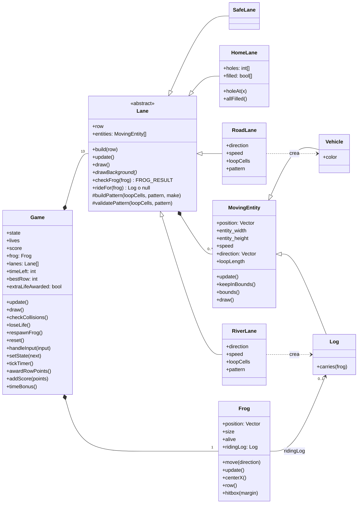
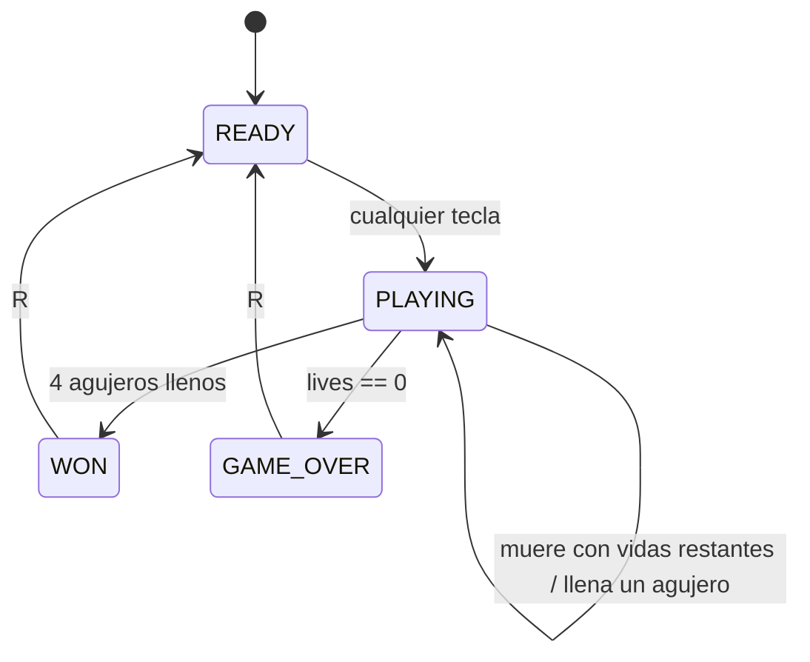
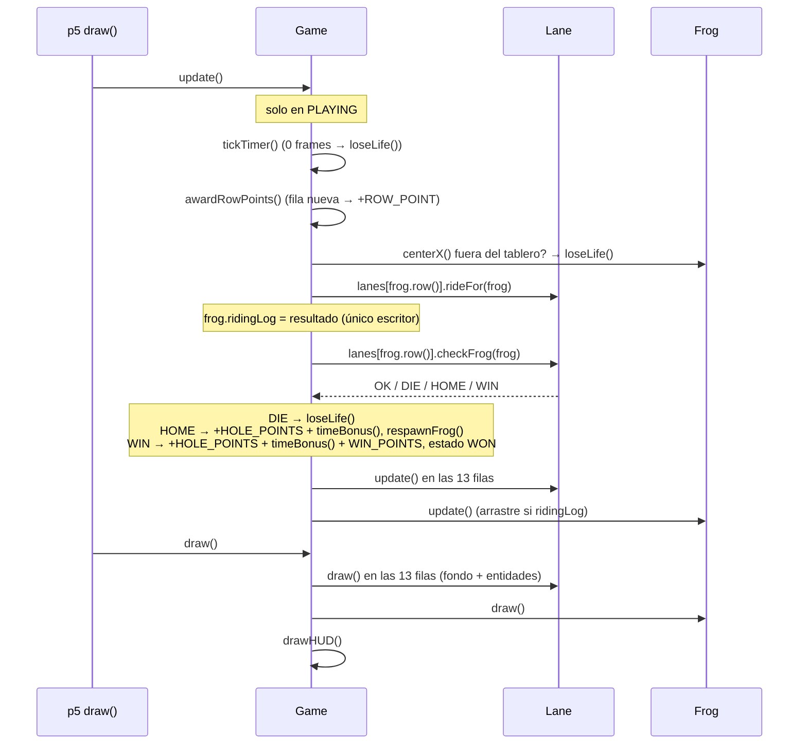

`# Frogger — Arquitectura

> Guía para el equipo de desarrollo · Proyecto de curso: Visual Computing (2026-II).
> Stack: JavaScript (ES6+) + p5.js (local, sin CDN) · Despliegue: GitHub Pages.

## 1. Objetivo

Recrear el primer nivel de Frogger. La rana se mueve sobre un tablero de 13×13 celdas: cruza la carretera esquivando carros y el río saltando sobre troncos, hasta llenar los 4 agujeros de la meta.

## 2. Estado del proyecto

### ✅ Funciona

- Tablero de 13 filas con HUD arriba (score) y abajo (vidas y tiempo).
- Rana con saltos de una celda (flechas o WASD), que no puede salir del tablero por sus propios medios.
- Carros y troncos con velocidad y dirección por fila, anchos distintos y reaparición con retraso (pista circular).
- Patrón inicial de cada fila definido a mano y validado al arrancar.
- Reglas completas:
  - carros que matan;
  - río que hunde;
  - troncos que transportan;
  - muerte al ser arrastrada fuera del tablero;
  - agujeros libres, ocupados y paredes de la meta.
- `frameRate(FPS)` fijo en `setup()`: las velocidades son píxeles por frame y p5 por defecto corre a la frecuencia del monitor.
- Tiempo por vida de 30 s contado en frames (exacto a `FPS`); al agotarse la rana muere. Se muestra en la barra inferior del HUD.
- Vidas, score del original (10 por cada fila nueva alcanzada, 50 por agujero + bonus de 10 por segundo restante, 1000 por llenar los 4) y estados `READY` → `PLAYING` → `WON` / `GAME_OVER`, con `R` para reiniciar.
- Vida extra a los 1 000 puntos, una sola vez por partida.

### ⏳ Falta para completar el primer nivel

En orden sugerido; los primeros son lógica pura y no dependen del aspecto visual.

| # | Tarea | Notas |
|---|---|---|
| 1 | HUD completo | Mensajes para `READY` / `WON` / `GAME_OVER`. Hoy el HUD ya muestra score, vidas y tiempo. |
| 2 | Pausa de muerte | Hoy la rana reaparece al instante. Congelar un momento, mostrar la muerte (atropellada / ahogada) y bloquear la entrada mientras dura. |
| 3 | Tortugas que se hunden | Subclase de `Log` con un ciclo de inmersión; `carries()` devuelve `false` mientras está bajo el agua. Necesita un aviso visual antes de hundirse. |
| 4 | Patrones del juego original | Ajustar `LANES` (velocidades, anchos, separaciones) al primer nivel del arcade. |
| 5 | Texturas | Sprites para rana, carros (un tipo por carretera), troncos, tortugas, agua, césped y agujeros. |
| 6 | Animaciones | Salto entre celdas, orientación de la rana según la dirección y animación de muerte. |

**Opcional / por decidir:**

- Peligros y bonus del original: serpiente, cocodrilos, mosca en un agujero, rana hembra.
- Pasar al siguiente nivel al llenar los agujeros. Hoy `WON` termina la partida.
- Sonido, pausa y récord persistente.

## 3. Tablero

13 columnas × 13 filas, `CELL = 55px` → tablero de 715×715. El canvas mide 715×825 porque añade dos barras de HUD de `HUD_H = CELL`: una arriba y otra abajo.

`Game.draw()` dibuja el tablero dentro de `translate(0, HUD_H)`. Así **toda la lógica usa coordenadas del tablero** (`y = 0` es la fila `HOME`), y solo el HUD usa coordenadas del canvas.

| Fila | Tipo | Clase | Contenido |
|---|---|---|---|
| 0 | `HOME` | `HomeLane` | 4 agujeros (columnas 1, 4, 7, 10) |
| 1–5 | `RIVER` | `RiverLane` | Troncos |
| 6 | `SAFE` | `SafeLane` | Isla central |
| 7–11 | `ROAD` | `RoadLane` | Carros |
| 12 | `SAFE` | `SafeLane` | Inicio (rana en columna 6) |

### 3.1 Filas en movimiento

Cada fila se define en la constante `LANES` (`game.js`) como `new RiverLane(direction, speed, loopCells, pattern)` o `new RoadLane(...)`:

| Parámetro | Significado |
|---|---|
| `direction` | −1 (←) o +1 (→). Común a toda la fila. |
| `speed` | Píxeles por frame. Común a toda la fila. |
| `loopCells` | Longitud de la **pista circular** de la fila, en celdas. Las celdas 0–12 son visibles; el resto queda fuera de pantalla. |
| `pattern` | `[{ x, w }]`: posición inicial y ancho de cada entidad, en celdas sobre la pista (`x ≥ 13` empieza fuera de pantalla). |

Cuando una entidad sale por un lado, recorre el tramo oculto de la pista antes de volver a entrar por el otro. Ese recorrido produce el retraso de reaparición del juego original. Las entidades se crean una vez por partida y nunca se borran.

`Lane.validatePattern()` hace fallar el juego al arrancar, con un mensaje que indica la fila, si:
- `loopCells < 13 + w` de la entidad más ancha, porque esa entidad aparecería de golpe dentro del tablero;
- dos entidades se solapan, también a través del *wrap*.

Valores actuales (provisionales, ver tarea 4):

| Fila | Tipo | Dir. | `speed` | `loopCells` | `pattern` (`x`/`w`) |
|---|---|---|---|---|---|
| 1 | `RIVER` | ← | 1.25 | 18 | 0/3 · 6/4 · 12/3 |
| 2 | `RIVER` | → | 1.0 | 17 | 0/4 · 7/4 · 13/2 |
| 3 | `RIVER` | ← | 1.5 | 18 | 1/5 · 9/3 · 14/2 |
| 4 | `RIVER` | → | 2.0 | 17 | 0/2 · 5/3 · 11/2 |
| 5 | `RIVER` | ← | 1.25 | 18 | 2/4 · 9/4 |
| 7 | `ROAD` | ← | 1.5 | 15 | 0/1 · 4/1 · 8/1 |
| 8 | `ROAD` | → | 2.5 | 16 | 0/2 · 7/2 |
| 9 | `ROAD` | ← | 2.0 | 17 | 0/3 · 8/3 |
| 10 | `ROAD` | → | 3.0 | 16 | 3/1 |
| 11 | `ROAD` | ← | 1.75 | 16 | 0/1 · 3/1 · 9/2 |

## 4. Archivos y componentes

Sin bundler (compatible con GitHub Pages). Los scripts se cargan en este orden en [`frogger/index.html`](../frogger/index.html), y el orden es obligatorio:

`p5.min.js` → `constants.js` → `entities.js` → `frog.js` → `lanes.js` → `game.js` → `frogger.js`

```
frogger/
├── index.html        # carga los scripts en el orden anterior
├── constants.js      # constantes compartidas: dimensiones, FPS, reglas y puntuación
├── entities.js       # MovingEntity (base), Vehicle, Log
├── frog.js           # Frog, rectsOverlap()
├── lanes.js          # Lane (interfaz base), SafeLane, HomeLane, RoadLane, RiverLane,
│                     #   FROG_RESULT
├── game.js           # Game, LANES (definición de las 13 filas), GAME_STATES, INPUT
├── frogger.js        # bootstrap de p5: setup(), draw(), keyPressed() y traducción de teclas. Sin lógica.
└── libraries/p5.min.js
```

| Archivo | Responsabilidad |
|---|---|
| `constants.js` | Dimensiones (`CELL`, `COLS`, `ROWS`, `BOARD`, `HUD_H`), `FPS` y reglas/puntuación de la partida. Sin lógica. |
| `entities.js` | Qué se mueve y cómo se pinta. No conoce las reglas. |
| `frog.js` | El jugador: salto, arrastre por tronco, caja de colisión. |
| `lanes.js` | Las reglas **de cada tipo de fila**: qué le pasa a la rana en carretera, río o meta. |
| `game.js` | El estado de la partida (vidas, score, estado), la máquina de estados de entrada y las reglas **comunes**. |
| `frogger.js` | Conecta p5.js con `Game`: traduce cada tecla a un `INPUT` neutro. |

Las constantes de `constants.js` se cargan primero (tras `p5.min.js`), así que todos los scripts pueden usarlas al cargar y las filas se crean directamente al cargar `game.js` (constante `LANES`).

## 5. Diagramas

### 5.1 Clases


```mermaid
classDiagram
    direction LR

    class Game {
        +state
        +lives
        +score
        +frog: Frog
        +lanes: Lane[]
        +timeLeft: int
        +bestRow: int
        +extraLifeAwarded: bool
        +update()
        +draw()
        +checkCollisions()
        +loseLife()
        +respawnFrog()
        +reset()
        +handleInput(input)
        +setState(next)
        +tickTimer()
        +awardRowPoints()
        +addScore(points)
        +timeBonus()
    }

    class Lane {
        <<abstract>>
        +row
        +entities: MovingEntity[]
        +build(row)
        +update()
        +draw()
        +drawBackground()*
        +checkFrog(frog) FROG_RESULT
        +rideFor(frog) Log o null
        #buildPattern(loopCells, pattern, make)
        #validatePattern(loopCells, pattern)
    }
    class SafeLane
    class HomeLane {
        +holes: int[]
        +filled: bool[]
        +holeAt(x)
        +allFilled()
    }
    class RoadLane {
        +direction
        +speed
        +loopCells
        +pattern
    }
    class RiverLane {
        +direction
        +speed
        +loopCells
        +pattern
    }

    class MovingEntity {
        +position: Vector
        +entity_width
        +entity_height
        +speed
        +direction: Vector
        +loopLength
        +update()
        +keepInBounds()
        +bounds()
        +draw()
    }
    class Vehicle {
        +color
    }
    class Log {
        +carries(frog)
    }

    class Frog {
        +position: Vector
        +size
        +alive
        +ridingLog: Log
        +move(direction)
        +update()
        +centerX()
        +row()
        +hitbox(margin)
    }

    Game *-- "13" Lane
    Game *-- "1" Frog
    Lane <|-- SafeLane
    Lane <|-- HomeLane
    Lane <|-- RoadLane
    Lane <|-- RiverLane
    Lane *-- "0..*" MovingEntity
    MovingEntity <|-- Vehicle
    MovingEntity <|-- Log
    RoadLane ..> Vehicle : crea
    RiverLane ..> Log : crea
    Frog --> "0..1" Log : ridingLog
```

- `Lane` es la interfaz que ve `Game`. Cada subclase **posee** sus entidades (`entities`), las crea en `build()` y decide qué le pasa a la rana en `checkFrog()`.
- `Game` no tiene listas de carros ni de troncos, y no pregunta de qué tipo es cada fila: recorre `lanes` y llama a los mismos métodos en todas.

### 5.2 Estados


```mermaid
stateDiagram-v2
    [*] --> READY
    READY --> PLAYING : cualquier tecla
    PLAYING --> PLAYING : muere con vidas restantes / llena un agujero
    PLAYING --> WON : 4 agujeros llenos
    PLAYING --> GAME_OVER : lives == 0
    WON --> READY : R
    GAME_OVER --> READY : R
```

### 5.3 Un frame


```mermaid
sequenceDiagram
    participant P5 as p5 draw()
    participant G as Game
    participant L as Lane
    participant F as Frog

    P5->>G: update()
    Note over G: solo en PLAYING
    G->>G: tickTimer() (0 frames → loseLife())
    G->>G: awardRowPoints() (fila nueva → +ROW_POINT)
    G->>F: centerX() fuera del tablero? → loseLife()
    G->>L: lanes[frog.row()].rideFor(frog)
    Note over G: frog.ridingLog = resultado (único escritor)
    G->>L: lanes[frog.row()].checkFrog(frog)
    L-->>G: OK / DIE / HOME / WIN
    Note over G: DIE → loseLife()<br/>HOME → +HOLE_POINTS + timeBonus(), respawnFrog()<br/>WIN → +HOLE_POINTS + timeBonus() + WIN_POINTS, estado WON
    G->>L: update() en las 13 filas
    G->>F: update() (arrastre si ridingLog)

    P5->>G: draw()
    G->>L: draw() en las 13 filas (fondo + entidades)
    G->>F: draw()
    G->>G: drawHUD()
```

Las reglas se aplican **antes** de mover. `Game.checkCollisions()` fija `frog.ridingLog` consultando `Lane.rideFor()` (único escritor: las filas no mutan a la rana), y después la rana y su tronco se desplazan lo mismo en ese frame, así que siguen alineados. El orden `tickTimer()` → `awardRowPoints()` → `checkCollisions()` → `lanes.update()` → `frog.update()` es exigido: el timer y las filas de puntos se resuelven sobre la posición de la rana del frame anterior, y `frog.update()` lee el `ridingLog` que acaba de fijar `checkCollisions()`.

## 6. Reglas

| Dónde | Regla |
|---|---|
| `RoadLane.checkFrog` | La caja de la rana (`hitbox()`, 4 px más pequeña por lado) toca un carro → `DIE`. |
| `RiverLane.rideFor` | El centro de la rana está sobre un tronco → lo devuelve; si no, `null`. `Game` lo guarda en `frog.ridingLog` (único escritor) y el tronco la arrastra. |
| `RiverLane.checkFrog` | Hay tronco bajo la rana → `OK`; si no → `DIE`. |
| `HomeLane.checkFrog` | El centro cae en un agujero libre → el agujero queda lleno y devuelve `HOME`, o `WIN` si con ese se llena el último. Pared o agujero lleno → `DIE`. |
| `Game.checkCollisions` | El centro de la rana sale del tablero (arrastrada por un tronco) → muere. |
| `Game.checkCollisions` | `HOME` → +`HOLE_POINTS` + bonus de tiempo y la rana reaparece. `WIN` → +`HOLE_POINTS` + bonus + `WIN_POINTS` y estado `WON` (la rana no reaparece). |
| `Game.tickTimer` | `timeLeft` baja 1 frame por frame; a 0 la rana muere. Se reinicia a `TIME_PER_LIFE` en cada cruce. |
| `Game.awardRowPoints` | `ROW_POINT` por cada fila nueva alcanzada, una vez por cruce (`bestRow` se reinicia al reaparecer). |
| `Game.addScore` | Único punto donde sube el score; al llegar a `EXTRA_LIFE_SCORE` otorga una vida extra, una sola vez por partida. |
| `Game.loseLife` | Toda muerte resta una vida; con 0 → `GAME_OVER`, si no la rana reaparece en columna 6, fila 12. |

## 7. Entrada

`keyPressed()` (en `frogger.js`) traduce `key`/`keyCode` — los únicos globals de p5 que toca el proyecto — a un `INPUT` neutro y llama a `game.handleInput(input)`, que es la **máquina de estados de entrada**: cada estado decide qué hacer con el comando, y `Game.setState()` es el único punto donde cambia el estado de la partida.

| `INPUT` | Origen (tecla) |
|---|---|
| `UP` / `DOWN` / `LEFT` / `RIGHT` | flechas / WASD |
| `RESTART` | `R` |
| `OTHER` | cualquier otra tecla |

| Estado | INPUT | Efecto |
|---|---|---|
| `READY` | cualquiera | Empieza la partida (no mueve la rana). |
| `PLAYING` | `UP` / `DOWN` / `LEFT` / `RIGHT` | Salto de una celda. |
| `WON` / `GAME_OVER` | `RESTART` | Partida nueva. |

## 8. Decisiones de diseño

| Tema | Decisión | Por qué |
|---|---|---|
| Coordenadas | Todo en píxeles del tablero con `p5.Vector`; la rana salta `CELL` px. | Rana y entidades comparten sistema; no hay conversión grid ↔ píxel al ir sobre un tronco. |
| Quién posee las entidades | Cada fila. | Polimorfismo: `Game` no necesita `instanceof` ni saber qué tipo de fila es. |
| Reaparición de entidades | Pista circular por fila con tramo oculto. | Mismo efecto que crear/borrar en el borde, pero sin listas que crecen y con un patrón determinista. |
| Patrones | A mano, en celdas, validados al arrancar. | Fácil de leer y de afinar jugando; un error de patrón se detecta enseguida. |
| Velocidad y ancho | Velocidad y dirección por fila, ancho por entidad. | Como en el original: troncos largos y cortos en la misma fila del río. |
| Colisión con carros | AABB con la caja de la rana reducida 4 px. | Rozar un carro con el borde no se siente como un choque. |
| Colisión con troncos y agujeros | Por el centro de la rana. | Tocar con una esquina no basta, y la rana puede llegar desalineada desde un tronco. |
| Arrastre | Suma directa a `position`, sin `move()`. | `move()` bloquea en los bordes y dejaría la rana desincronizada del tronco. |
| Timestep | Píxeles por frame, sin `deltaTime`, a `FPS` fijos (`frameRate(FPS)` en `setup()`). | Simple para el MVP; el timer por vida se cuenta en frames enteros, exacto a esa frecuencia. |
| Puntuación | `Game.addScore()` es el único punto donde sube el score; los valores de filas, agujeros y victoria viven en `constants.js`. | La vida extra se audita en un solo sitio y las reglas de puntos se ajustan en un solo archivo. |
| Quién decide la victoria | `HomeLane`: devuelve `WIN` al llenar el último agujero; `Game` solo reacciona a `FROG_RESULT`. | `Game` no conoce los agujeros, y el enum `OK / DIE / HOME / WIN` cierra el contrato: ninguna otra fila puede devolver un resultado que `Game` no sepa manejar. |
| Entrada | `frogger.js` traduce `key`/`keyCode` de p5 a un `INPUT` neutro; `Game.handleInput()` es la máquina de estados y `setState()` el único cambio de estado. `Frog.move()` recibe la dirección en celdas, sin p5. | El núcleo del juego no conoce los globals de p5, y las transiciones `READY` / `PLAYING` / `WON` / `GAME_OVER` se auditan en un solo sitio. |
| `ridingLog` | `Game.checkCollisions()` es el único escritor: pregunta `Lane.rideFor()` (consulta pura) y guarda el resultado; `Frog` solo lo lee. | Las filas no mutan a la rana y la corrección (arrastre) no depende del orden de las llamadas. |
| Constantes | `constants.js` se carga primero, tras `p5.min.js`. | Todos los scripts pueden usar `CELL` / `BOARD` / ... al cargar; no hay dependencia inversa con el último script. |
